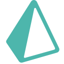

# Hi there!  This is Khalid Hasan

  

  

  
  &nbsp;
  

  <i>🔍 I believe that true happiness lies in solving problems. Life is a journey of overcoming challenges, and I find joy in turning complex problems into elegant solutions.</i>

 

## 👨‍💻 About Me

- 🌍  I'm based in **Dhaka, Bangladesh**
- 🖥️  See my portfolio at [**My Portfolio**](http://khalid-hasan98.vercel.app)
- ✉️  Contact me at [**khalid.hasan9753@gmail.com**](mailto:khalid.hasan9753@gmail.com)
- 🚀  Currently building [**MyTaskFolio**](http://mytaskfolio.vercel.app)
- 🧠  Learning **Data Structures and Algorithms**
- 🤝  Open to collaborating on **Open Source Projects**
- ⚡  **Fun fact:** I'm secretly Spiderman - finding bugs all day :)

 

## 🏆 Trophies & Stats

  

 

  
  

 

  

 

  

 

## 🛠️ Technologies & Tools

<table align="center">
  <tr>
    <td align="center" width="96">
      
       HTML5
    </td>
    <td align="center" width="96">
      
       CSS3
    </td>
    <td align="center" width="96">
      
       JavaScript
    </td>
    <td align="center" width="96">
      
       TypeScript
    </td>
    <td align="center" width="96">
      
       React
    </td>
     <td align="center" width="96">
      
       Next.js
    </td>
  </tr>
  <tr>
    <td align="center" width="96">
      
       Redux
    </td>
    <td align="center" width="96">
      
       Tailwind
    </td>
    <td align="center" width="96">
      
       MUI
    </td>
     <td align="center" width="96">
      
       ChakraUI
    </td>
    <td align="center" width="96">
      
       Ant Design
    </td>
     <td align="center" width="96">
      
       Bootstrap
    </td>
  </tr>
  <tr>
    <td align="center" width="96">
      
       Node.js
    </td>
    <td align="center" width="96">
      
       Express
    </td>
    <td align="center" width="96">
      
       MongoDB
    </td>
    <td align="center" width="96">
      
       PostgreSQL
    </td>
    <td align="center" width="96">
      
       Prisma
    </td>
     <td align="center" width="96">
      
       Firebase
    </td>
  </tr>
    <tr>
    <td align="center" width="96">
      
       NextAuth
    </td>
    <td align="center" width="96">
      
       JWT
    </td>
    <td align="center" width="96">
      
       Postman
    </td>
  </tr>
</table>

 

## 🏆 Experience

### **Full-Stack Developer** @ [SM Technology](https://www.facebook.com/smtechnologybd)
*Oct 2024 - Present | Onsite | Dhaka, Bangladesh*
- 🏗️ Built large-scale application backends, focusing on scalability and performance.
- 💬 Developed a real-time chat system, enabling seamless communication between users.
- 💳 Integrated and managed various payment systems to ensure secure and reliable transactions.
- 🔄 Developed and connected frontend functionality, integrating APIs with the backend.

### **Full-Stack Developer** @ Bangladeshi Software
*Jan 2024 - Sep 2024 | Onsite | Dinajpur, Bangladesh*
- 👥 Served as Backend Team Lead, creating and managing large-scale backend systems.
- 🎨 Designed frontend interfaces and integrated APIs with the backend.
- 📊 Conducted project analysis and provided guidance to other team members.

### **Frontend Developer** @ Dizitecno
*Mar 2024 - Present | Remote | Dhaka, Bangladesh*
- ♿ Built responsive, accessible interfaces for users.
- 🤝 Worked closely with backend developers to connect APIs and manage data flow.
- ⚡ Used JavaScript frameworks and libraries to improve site functionality and speed.

### **Frontend Developer Intern** @ Syavi Publication
*Jan 2023 - Aug 2023 | Remote | Hyderabad, India*
- 🧩 Built individual components using React.
- 📱 Adjusted and improved the responsiveness of layouts created by other developers.
- 🎨 Ensured consistent styling and functionality across different devices.

 

## 📬 Connect with me

  
  &nbsp;&nbsp;&nbsp;
  
  &nbsp;&nbsp;&nbsp;
  
  &nbsp;&nbsp;&nbsp;
  

 

  

